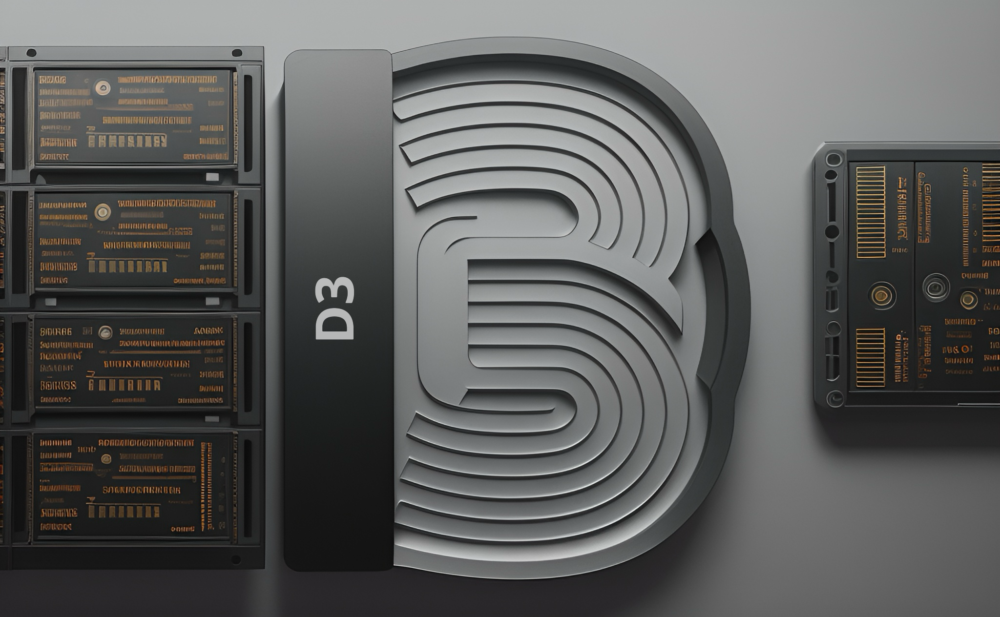

<div align="center">

# **D3 Subnet** <!-- omit in toc -->
[](https://discord.gg/bittensor)
[](https://opensource.org/licenses/MIT) 

---
    
## The Incentivized Internet <!-- omit in toc -->

[Discord](https://discord.gg/bittensor) • [Network](https://taostats.io/) • [Research](https://bittensor.com/whitepaper) • [Bittensor Dataset Hub](https://huggingface.co/bittensor-dataset)
</div>


## What is D3 Subnet?

The D3 Subnet, standing for *`Decentralized Distributed Data`* Scraping subnet, plays a crucial role in the advancement of artificial intelligence by ensuring ample training data for all Bittensor AI networks.

We're building **[Bittensor Dataset Hub](https://huggingface.co/bittensor-dataset)**.

##  what makes this different from other scraping subnets?

The purpose of the d3_subnet is to generate the training datasets essential for Bittensor’s AI models. To achieve this, we have implemented a novel mechanism that rapidly constructs diverse datasets without duplication.

We replaced the traditional synapse-based method with Subtensor’s commit function, allowing miners to submit their scraped data at any time without restrictions. This increases competitiveness, as only the top miners receive incentives. This prevented one person from receiving rewards by occupying multiple slots with the same data, as in previous mechanisms.

We will work closely with other subnets to create the best query datasets in the shortest amount of time.

We have integrated a scraper that operates independently of centralized APIs like Apify. Instead, it utilizes a network of Twitter accounts, ensuring that this subsystem remains fully decentralized. (https://github.com/gitphantomman/d3_subnet/blob/main/scraping/twitter/twitter_scraper_v3.py)


## Incentive Mechanism

Miners within the D3 Subnet are assessed based on the volume of unique data they contribute to the network, excluding any duplicates. To excel, miners are encouraged to gather as much data as possible, and commit their findings as fast and frequently as possible to the blockchain. 
We continuously check up-to-date information to calculate each miner's score accurately. 
To ensure the accuracy of data counts while eliminating duplicates, validators require a Redis database equipped with an indexing table.

## Our Roadmap

- Collaboration for Training Datasets

    Partnering with other AI model training subnets to produce the training datasets required for Bittensor.
    
    We have established contacts with SN14, SN15, SN9, and several other subnets, and we will produce datasets for these subnets sequentially.

- Fair Incentive Evaluation

    Addressing the issue of fair incentive evaluation for miners post-launch.

    After launch, we plan to design the reward distribution curve exponentially, ensuring that the top miner receives almost of the reward. This approach will foster competition and ensure that subnets achieve the highest quality and speed.


- Expanded Datasets

    Enhancing our dataset to include not only text and images from Twitter but also video and audio datasets.
    
    Additionally, we plan to expand our scraping sources beyond Twitter to include other social media platforms.

- Decentralization

    Finding solutions to fully decentralize the centralized services currently used for scraping.

    We have already integrated a non-Apify scraper and are committed to finding solutions for decentralized scrapers across different subnets. This will help us achieve full decentralization for the D3 Subnet and Bittensor.
- Website Launch

    Launching a website to showcase the usefulness of our data and its applications, highlighting the appeal of Bittensor to a broader audience beyond our platform.

## Getting Started

### Clone the repository from github

```bash
git clone git@github.com:gitphantomman/d3_subnet.git
cd d3_subnet
```

### Install python virtual environment

```bash
python3 -m venv my-env
. my-env/bin/activate
```

### Install dependancies

```bash
python3 -m pip install -e .
python3 -m pip install -r requirements.txt
```

### Register hotkey to subnet

- Please reference [Register guide](https://docs.bittensor.com/subnets/register-validate-mine).
- Check if you're registered to subnet using `btcli w overview --subtensor.network finney --wallet.name miner`.
- You can check the metagraph using `btcli subnets metagraph --subtensor.network finney --netuid 6`.

See [Miner Setup](docs/miner.md) to learn how to set up a Miner.

See [Validator Setup](docs/validator.md) to learn how to set up a Validator.


## License
This repository is licensed under the MIT License.
```text
# The MIT License (MIT)
# Copyright © 2023 Yuma Rao

# Permission is hereby granted, free of charge, to any person obtaining a copy of this software and associated
# documentation files (the “Software”), to deal in the Software without restriction, including without limitation
# the rights to use, copy, modify, merge, publish, distribute, sublicense, and/or sell copies of the Software,
# and to permit persons to whom the Software is furnished to do so, subject to the following conditions:

# The above copyright notice and this permission notice shall be included in all copies or substantial portions of
# the Software.

# THE SOFTWARE IS PROVIDED “AS IS”, WITHOUT WARRANTY OF ANY KIND, EXPRESS OR IMPLIED, INCLUDING BUT NOT LIMITED TO
# THE WARRANTIES OF MERCHANTABILITY, FITNESS FOR A PARTICULAR PURPOSE AND NONINFRINGEMENT. IN NO EVENT SHALL
# THE AUTHORS OR COPYRIGHT HOLDERS BE LIABLE FOR ANY CLAIM, DAMAGES OR OTHER LIABILITY, WHETHER IN AN ACTION
# OF CONTRACT, TORT OR OTHERWISE, ARISING FROM, OUT OF OR IN CONNECTION WITH THE SOFTWARE OR THE USE OR OTHER
# DEALINGS IN THE SOFTWARE.
```

